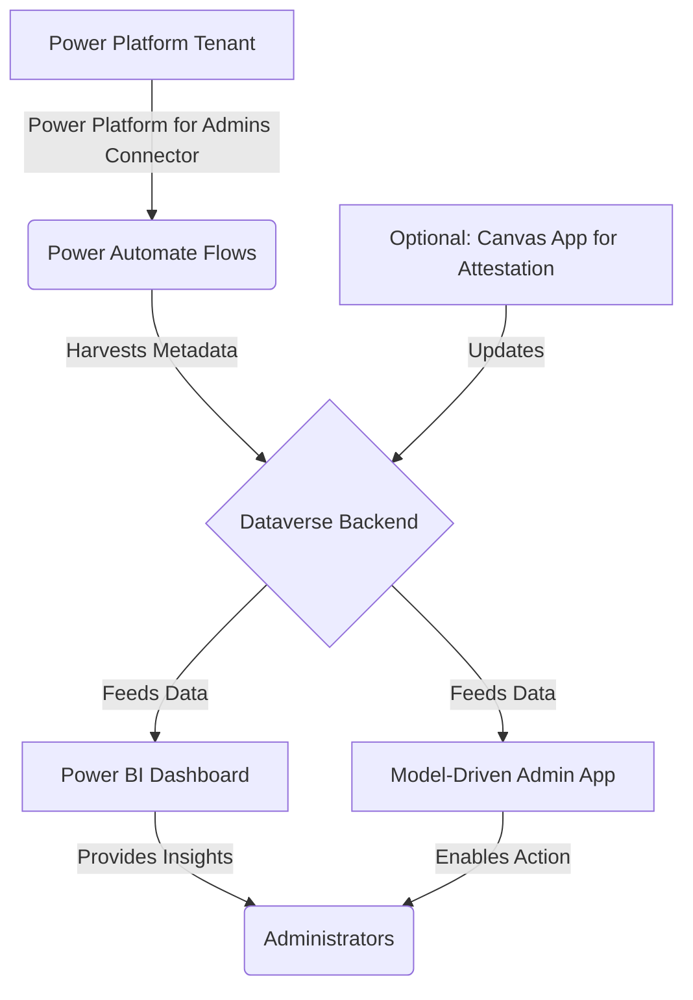

# Power Platform Governance & Security Sentinel

A comprehensive, open-source solution for governing and securing your Microsoft Power Platform tenant.

---

## The Problem: The Wild West of Citizen Development

The Microsoft Power Platform (Power Apps, Power Automate) empowers business users to build applications and automations at an unprecedented scale. While this drives innovation, it often creates a significant governance and security blind spot for IT and security teams. This "shadow IT" can lead to:

*   **Uncontrolled Costs:** Proliferation of apps using premium connectors without oversight.
*   **Data Leakage:** Sensitive business data being inadvertently shared with non-approved external services (e.g., social media, personal cloud storage).
*   **Security Vulnerabilities:** Flows running with elevated privileges or using insecure connectors.
*   **Operational Risk:** Critical business processes becoming dependent on apps and flows owned by a single employee, creating a single point of failure if that employee leaves.

Organizations are struggling to get timely, actionable answers to fundamental governance questions. This project provides the answers.

## The Solution: A Sentinel for Your Tenant

The **Power Platform Governance & Security Sentinel** is an easily deployable solution that provides a centralized, holistic view of your entire Power Platform inventory. It automates the process of discovery, analysis, and reporting, turning raw tenant data into actionable security and governance insights.

This solution continuously scans your environment and populates a dedicated Dataverse backend, which then feeds a comprehensive Power BI dashboard and a model-driven administrative app.

## Key Features

*   **Automated Tenant Scanning:** Uses Power Automate flows with the Power Platform for Admins connectors to inventory all apps, flows, connectors, and owners.
*   **Centralized Data Repository:** Stores all harvested metadata in a dedicated, secure Dataverse instance.
*   **Rich Interactive Dashboard:** A Power BI report provides a single pane of glass to visualize:
    *   App and flow growth over time.
    *   Usage of premium vs. standard connectors.
    *   Connectors with potential for data leakage (e.g., social media, FTP).
    *   Orphaned apps and flows.
    *   Highly privileged flows.
*   **Administrative Command Center:** A Model-Driven Power App allows administrators to review assets, flag items for follow-up, and manage the governance process.
*   **Extensible & Open-Source:** Built entirely on the Power Platform and designed to be customized and extended by the community.

## Architecture

This solution is comprised of several interconnected components, all running within your Power Platform environment.

## Getting Started

Ready to deploy the Security Sentinel in your environment? Follow our comprehensive guides:

### Quick Start
1.  **Review Prerequisites:** Ensure you have the necessary Power Platform licenses and administrative permissions
2.  **Follow the Implementation Guide:** See [IMPLEMENTATION_GUIDE.md](docs/IMPLEMENTATION_GUIDE.md) for detailed step-by-step instructions
3.  **Build the Solution:** Create the Dataverse tables, Power Automate flows, and Model-Driven App
4.  **Deploy the Dashboard:** Connect Power BI to your Dataverse instance and publish the dashboard

### Documentation
- **[Installation Guide](docs/INSTALLATION.md)** - Prerequisites and environment setup
- **[Implementation Guide](docs/IMPLEMENTATION_GUIDE.md)** - Complete step-by-step build instructions (8-12 hours)
- **[Architecture Overview](docs/ARCHITECTURE.md)** - Technical architecture and design decisions
- **[Roadmap](docs/ROADMAP.md)** - Planned features and enhancements
- **[FAQ](docs/FAQ.md)** - Frequently asked questions and troubleshooting

## How to Contribute

We welcome contributions from the community! Please read our [CONTRIBUTING.md](CONTRIBUTING.md) file for details on our code of conduct and the process for submitting pull requests.

## License

This project is licensed under the MIT License - see the [LICENSE](LICENSE) file for details.

## Publications and Resources

### Whitepaper
- [The Governance Imperative in the Age of Citizen Development](docs/Power_Platform_Governance_Whitepaper.md) - A comprehensive whitepaper examining the challenges of ungoverned citizen development and the case for automated governance.

### Technical Articles
- [Building a Security Sentinel for Microsoft Power Platform: A Technical Deep Dive](docs/Technical_Article_Building_a_Security_Sentinel.md) - An in-depth technical article walking through the architecture and implementation of the solution.

These publications are designed to support thought leadership, community education, and can be cited in your own work.
