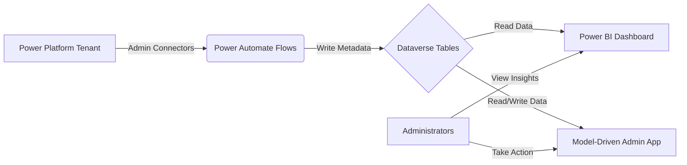

# Architecture Overview

This document provides a detailed technical overview of the Power Platform Governance & Security Sentinel solution architecture.

## High-Level Architecture

The solution is built entirely on the Microsoft Power Platform and consists of the following key components:

1.  **Data Collection Layer (Power Automate Flows):** Automated flows that use the Power Platform for Admins connectors to scan the tenant and extract metadata.
2.  **Data Storage Layer (Dataverse):** A custom data model in Dataverse that stores all harvested information.
3.  **Presentation Layer (Power BI & Model-Driven App):** Interactive dashboards and administrative interfaces for viewing and acting on the data.

## Data Collection Layer

The data collection layer is responsible for continuously scanning the Power Platform tenant and extracting relevant metadata. This is achieved through a series of Power Automate flows.

### Key Flows

| Flow Name | Purpose | Schedule | Connectors Used |
| :--- | :--- | :--- | :--- |
| **Scan - Harvest All Power Apps** | Retrieves all Canvas and Model-Driven Apps, including their owners, shared users, and connection references. | Daily (configurable) | Power Platform for Admins, Dataverse |
| **Scan - Harvest All Power Automate Flows** | Retrieves all Cloud Flows, including their owners, triggers, actions, and connection references. | Daily (configurable) | Power Platform for Admins, Dataverse |
| **Scan - Harvest All Connectors** | Retrieves all custom and standard connectors used in the tenant, along with their security classification. | Daily (configurable) | Power Platform for Admins, Dataverse |
| **Analyze - Detect Data Leakage Risks** | Analyzes apps and flows to identify those using connectors that could lead to data leakage (e.g., social media, FTP, external databases). | Daily (after harvest flows) | Dataverse |
| **Analyze - Identify Orphaned Assets** | Identifies apps and flows where the owner account is disabled or no longer exists. | Daily (after harvest flows) | Dataverse, Microsoft Graph |

### Data Extraction Strategy

The flows use the following Power Platform for Admins connector actions:

*   `List Apps as Admin`: Retrieves all apps in the tenant.
*   `Get App as Admin`: Retrieves detailed information about a specific app.
*   `List Flows as Admin`: Retrieves all flows in the tenant.
*   `Get Flow as Admin`: Retrieves detailed information about a specific flow, including its definition (JSON).
*   `List Connectors as Admin`: Retrieves all connectors.

The flows parse the JSON responses from these actions and write the relevant data to Dataverse tables.

## Data Storage Layer

The data storage layer is a custom data model built in Dataverse. It consists of several tables that store the harvested metadata.

### Core Tables

| Table Name | Description | Key Columns |
| :--- | :--- | :--- |
| **Governance - Power App** | Stores information about each Power App. | App ID, App Name, Display Name, Owner, Environment, Created Date, Modified Date, App Type (Canvas/Model-Driven), Is Shared, Connector Count |
| **Governance - Power Automate Flow** | Stores information about each Power Automate Flow. | Flow ID, Flow Name, Display Name, Owner, Environment, Created Date, Modified Date, State (On/Off), Trigger Type, Action Count, Connector Count |
| **Governance - Connector Usage** | Stores information about which connectors are used by which apps and flows. | App/Flow Reference, Connector Name, Connector ID, Connector Tier (Standard/Premium), Risk Level (Low/Medium/High) |
| **Governance - Environment** | Stores information about each Power Platform environment. | Environment ID, Environment Name, Environment Type (Production/Sandbox/Trial), Region |
| **Governance - Owner** | Stores information about app and flow owners. | User ID, Display Name, Email, Account Status (Active/Disabled), Department |
| **Governance - Risk Flag** | Stores flagged items that require administrative review. | Asset Reference (App/Flow), Risk Type, Risk Description, Flagged Date, Reviewed (Yes/No), Reviewer, Review Notes |

### Relationships

The tables are related as follows:

*   **Governance - Power App** has a many-to-one relationship with **Governance - Environment**.
*   **Governance - Power App** has a many-to-one relationship with **Governance - Owner**.
*   **Governance - Power Automate Flow** has a many-to-one relationship with **Governance - Environment**.
*   **Governance - Power Automate Flow** has a many-to-one relationship with **Governance - Owner**.
*   **Governance - Connector Usage** has a many-to-one relationship with **Governance - Power App** (polymorphic, can also relate to **Governance - Power Automate Flow**).
*   **Governance - Risk Flag** has a many-to-one relationship with **Governance - Power App** or **Governance - Power Automate Flow** (polymorphic).

## Presentation Layer

The presentation layer provides administrators with the ability to view, analyze, and act on the governance data.

### Power BI Dashboard

The Power BI dashboard is the primary interface for viewing governance insights. It includes the following pages:

1.  **Executive Summary:** High-level KPIs such as total app count, flow count, active vs. inactive assets, and premium connector usage.
2.  **App Inventory:** Detailed list of all apps with filters for environment, owner, and connector usage.
3.  **Flow Inventory:** Detailed list of all flows with filters for environment, owner, trigger type, and state.
4.  **Connector Analysis:** Breakdown of connector usage by type, tier, and risk level. Identifies apps and flows using high-risk connectors.
5.  **Risk Dashboard:** Displays all flagged items that require review, with drill-through capabilities to see details.
6.  **Orphaned Assets:** Lists all apps and flows where the owner account is disabled or no longer exists.

The dashboard uses DirectQuery to connect to Dataverse, ensuring that the data is always up-to-date.

### Model-Driven Admin App

The Model-Driven App provides a structured interface for administrators to:

*   Browse the governance data in a tabular format.
*   View detailed information about each app, flow, and connector.
*   Flag items for review and add notes.
*   Mark flagged items as reviewed.
*   Initiate workflows for archival or decommissioning.

The app is built on the custom Dataverse tables and leverages the Unified Interface for a modern, responsive user experience.

## Security Considerations

*   **Least Privilege:** The service account used to run the flows should have only the necessary permissions (Power Platform Administrator role).
*   **Data Residency:** All data is stored in Dataverse within your tenant's geographic region.
*   **Access Control:** Use Dataverse security roles to control who can view and modify the governance data.
*   **Audit Logging:** Enable auditing on the Dataverse tables to track all changes to the governance data.

## Extensibility

The solution is designed to be extended and customized:

*   **Custom Risk Rules:** Add new flows to implement custom risk detection logic.
*   **Additional Data Sources:** Integrate data from other sources (e.g., Azure AD, Microsoft 365 usage reports) to enrich the governance data.
*   **Custom Dashboards:** Create additional Power BI reports or Canvas Apps to visualize the data in different ways.
*   **Automated Remediation:** Build flows that automatically take action on flagged items (e.g., send notifications, disable flows).

