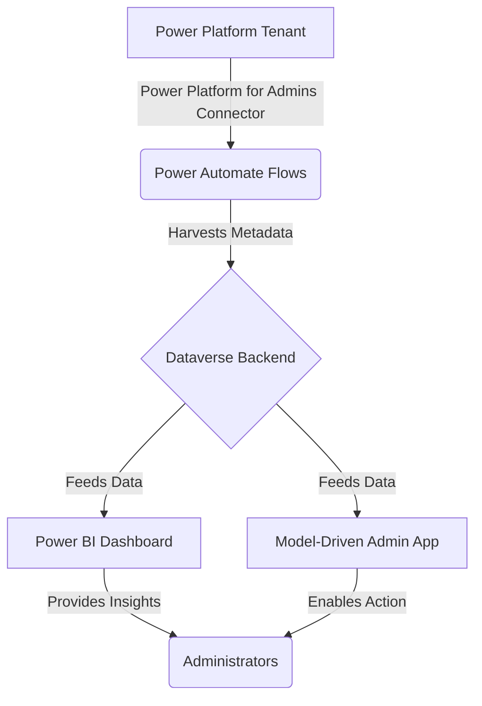

# Building a Security Sentinel for Microsoft Power Platform: A Technical Deep Dive

**Author:** rkneela0912

**Date:** October 9, 2025

## Introduction

The rapid adoption of Microsoft Power Platform has empowered a new wave of citizen developers, driving unprecedented innovation. However, this speed and scale come with a significant challenge: maintaining governance and security. As thousands of apps and flows are created, IT and security leaders are often left in the dark, unable to answer critical questions about data exposure, compliance, and operational risk. The **Power Platform Governance & Security Sentinel** is an open-source solution designed to address this challenge head-on. This technical article provides a deep dive into the architecture and implementation of the Sentinel, demonstrating how it provides a robust, automated framework for governing the Power Platform at scale.

## High-Level Architecture

The Sentinel is architected as a fully integrated solution built entirely on the Power Platform itself. This “in-platform” approach ensures seamless integration, leverages native security features, and provides a familiar environment for administrators. The architecture is comprised of three primary layers: a data collection layer, a data storage layer, and a presentation layer.

**Figure 1: High-Level Architecture of the Power Platform Governance & Security Sentinel**

The workflow is straightforward yet powerful:

1.  **Data Collection:** A series of Power Automate flows act as the engine, using the **Power Platform for Admins** connectors to continuously scan the tenant and harvest metadata about every app, flow, connector, and environment.
2.  **Data Storage:** The collected metadata is then structured and stored in a custom data model within **Microsoft Dataverse**. This provides a scalable, secure, and relational database that serves as the single source of truth for all governance data.
3.  **Data Presentation:** The curated data in Dataverse is surfaced to administrators through two interfaces: a **Power BI Dashboard** for rich, interactive visualizations and trend analysis, and a **Model-Driven Power App** that serves as an administrative command center for taking action and managing remediation workflows.

## The Data Storage Layer: A Dataverse Foundation

The heart of the Sentinel is its robust data model, built on Microsoft Dataverse. Using Dataverse as the foundation provides several key advantages, including granular role-based security, scalability to handle millions of records, and native integration with the rest of the Power Platform. The data model is designed to create a comprehensive inventory of all Power Platform assets and their relationships.

### Core Dataverse Tables

The data model consists of several custom tables designed to store specific information about the Power Platform assets.

| Table Name | Description | Key Columns |
| :--- | :--- | :--- |
| **Governance - Power App** | Stores a record for each Power App in the tenant. | App ID, App Name, Owner, Environment, Created Date, App Type, Is Shared, Connector Count |
| **Governance - Power Automate Flow** | Stores a record for each Power Automate Flow. | Flow ID, Flow Name, Owner, Environment, State (On/Off), Trigger Type, Action Count |
| **Governance - Connector Usage** | A junction table that maps connectors to the apps and flows that use them. | Asset Reference (App/Flow), Connector Name, Connector Tier (Standard/Premium), Risk Level |
| **Governance - Environment** | Stores information about each Power Platform environment. | Environment ID, Environment Name, Environment Type (Production/Sandbox), Region |
| **Governance - Risk Flag** | Stores a record for any asset that is flagged as high-risk or non-compliant. | Asset Reference (App/Flow), Risk Type, Risk Description, Flagged Date, Reviewed Status |

This relational structure allows for powerful queries and analysis. For example, an administrator can easily identify all apps in production environments that use a specific high-risk connector and are shared with more than 100 users.

## The Data Collection Layer: Automated Harvesting with Power Automate

The data collection layer is powered by a series of Power Automate flows that run on a scheduled basis. These flows are the workhorses of the Sentinel, responsible for keeping the Dataverse repository up-to-date.

### Key Flows and Logic

The primary flows are:

*   **Scan - Harvest All Power Apps:** Retrieves all Canvas and Model-Driven Apps.
*   **Scan - Harvest All Power Automate Flows:** Retrieves all Cloud Flows.
*   **Analyze - Detect Data Leakage Risks:** Identifies apps and flows using risky connector combinations.
*   **Analyze - Identify Orphaned Assets:** Finds assets owned by disabled or deleted user accounts.

The core of these flows is the **Power Platform for Admins** connector, which provides the necessary actions to query the tenant inventory. For example, the `Scan - Harvest All Power Apps` flow follows this logic:

1.  **Trigger:** The flow is triggered on a daily schedule.
2.  **List Environments:** It first uses the `Get Environments as Admin` action to retrieve a list of all environments in the tenant.
3.  **Loop Through Environments:** It then iterates through each environment.
4.  **List Apps:** Inside the loop, it uses the `Get Apps as Admin` action to retrieve a list of all apps in the current environment.
5.  **Loop Through Apps:** It then iterates through each app.
6.  **Upsert to Dataverse:** For each app, it uses the Dataverse connector's `Upsert` action to create a new record or update an existing one in the **Governance - Power App** table. The app's unique ID is used as the key to prevent duplicates.

This process is repeated for flows and connectors, ensuring that the governance data is continuously refreshed. Error handling is built into each flow to ensure that failures are logged and do not interrupt the entire process.

## The Presentation Layer: Actionable Insights

Raw data is only useful if it can be transformed into actionable insights. The Sentinel's presentation layer is designed to do just that, providing administrators with the tools they need to understand their Power Platform landscape and take action.

### Power BI Dashboard

The Power BI dashboard connects directly to the Dataverse backend using **DirectQuery**, ensuring that the data is always real-time. The dashboard includes several pages:

*   **Executive Summary:** High-level KPIs, such as total app and flow counts, premium connector usage, and the number of orphaned assets.
*   **App & Flow Inventory:** Detailed, filterable lists of all apps and flows, allowing administrators to drill down into specific environments, owners, or connector usage.
*   **Connector Analysis:** A breakdown of connector usage by tier (Standard, Premium, Custom) and risk level, highlighting apps and flows that use potentially dangerous connectors like social media or FTP services.
*   **Risk Dashboard:** A prioritized list of all assets that have been flagged by the analysis flows, allowing administrators to focus on the most critical issues first.

### Model-Driven Admin App

While the Power BI dashboard is for analysis, the Model-Driven App is for action. Built on the custom Dataverse tables, this app provides a structured interface for administrators to:

*   **Review Flagged Items:** View a queue of all high-risk and non-compliant assets.
*   **Manage Remediation:** Assign tasks, add notes, and track the status of remediation efforts.
*   **Enforce Policies:** Trigger workflows to notify owners, disable apps, or archive unused assets.
*   **Maintain Governance Records:** Provides a complete audit trail of all governance activities.

## Implementation and Extensibility

The Sentinel is distributed as a managed solution package, making it easy to deploy into any Power Platform environment. The installation process involves importing the solution, configuring the connection references for the Power Platform for Admins and Dataverse connectors, and running an initial setup flow.

As an open-source project, the Sentinel is designed to be extensible. Organizations can customize the solution to meet their specific needs by:

*   **Adding Custom Risk Rules:** Creating new Power Automate flows to detect organization-specific risks.
*   **Integrating Additional Data Sources:** Enriching the governance data with information from other systems, such as Azure AD or Microsoft 365 usage reports.
*   **Building Automated Remediation:** Creating flows that automatically take action on flagged items, such as sending approval requests or disabling non-compliant apps.

## Conclusion

The **Power Platform Governance & Security Sentinel** provides a comprehensive, automated, and actionable solution to the challenges of Power Platform governance. By leveraging the power of the platform itself, it offers a robust and extensible framework for securing the tenant, ensuring compliance, and enabling safe innovation. Its open-source nature invites community collaboration and ensures that it can evolve to meet the ever-changing needs of the Power Platform ecosystem.

To explore the project, contribute to its development, or deploy it in your own organization, please visit the GitHub repository at [https://github.com/rkneela0912/powerplatform-governance-sentinel](https://github.com/rkneela0912/powerplatform-governance-sentinel).

